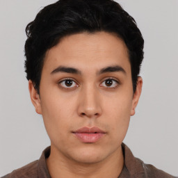
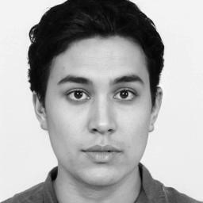
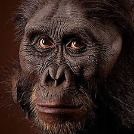
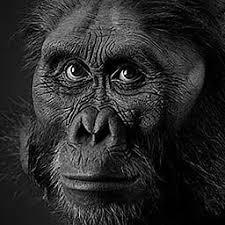

# Transform images to gray scale using CPU and GPU
This repo is my implementation of fifth assignment for PPDS course at FEI STU.

## What does this code do
This repo contains implementation of gray scale transformation in Python. This code is ran on CPU.
However this repo also contains implementation of said transformation using Numba compiler and CUDA
parallel computing platform.

## What is Numba and CUDA
According to [official site](https://numba.pydata.org):
Numba translates Python functions to optimized machine code at runtime using the industry-standard LLVM compiler library. Numba-compiled numerical algorithms in Python can approach the speeds of C or FORTRAN.

In this project Numba is used to run CUDA code in Python.
According to [official site](https://blogs.nvidia.com/blog/2012/09/10/what-is-cuda-2/):
CUDA is a parallel computing platform and programming model created by NVIDIA. CUDA helps developers speed up their applications by harnessing the power of GPU accelerators.

## How is CUDA used in this project
In this project CUDA is used to speed up the transformation of images. The image transformation to gray scale is 
ideal problem for demonstration of CUDA capabilities since it is fundamentally SIMD (Single instruction multiple data) problem. 
Thus we can take advantage of GPU architecture as it can spawn multiple processes. Every process can then compute transformation
for one pixel.

## How to use this project
This project consists of single python script `main.py`. To run this program, you need some prerequisites: 
1. Python 3.10 installed on your system
2. Matplotlib installed on your system
3. Numpy installed on your system

After fulfilling these requirements, you should be able to run this script with command `python main.py` (assuming your shell's working directory is the directory where script is located).
After running the command, the script will generate two files `image-1-grayscale-cpu.jpg` and `image-1-grayscale-gpu.jpg` and print out the duration of each transformation. Those are the images transformed to gray scale. You can play around with this script and transform other images from `images` folder by changing constanct `IMAGE_NAME`.

## What computation is used to perform gray scale transformation
The formula used for gray scale transformation is `Y = 0.299R + 0.587G + 0.114B`. You can read more about 
this formula [here](https://en.wikipedia.org/wiki/Grayscale#Converting_color_to_grayscale).

## Measuring performance
Using CUDA should greatly improve the performance of transformation. However we are not using CUDA directly, we are using it's emulated version through Numba. This results in weak performance on my machine (M1 Macbook Air). These times should be greatly improved when using NVIDIA GPUs.

Below are times measured for each image transformation

| Image            | CPU transformation | GPU transformation |
| ---------------- | ----------------   | ----------------   |
| images-1.jpeg     | 0.0017             | 6.0656             |
| images-2.jpeg     | 0.0014             | 5.7184             |
| images-3.jpeg     | 0.0013             | 5.7798             |
| images-4.jpeg     | 0.0014             | 5.7255             |
| images-5.jpeg     | 0.0012             | 5.7481             |
| images-6.jpeg     | 0.0012             | 5.9617             |
| images-7.jpeg     | 0.0013             | 5.8885             |
| images-8.jpeg     | 0.0013             | 5.9563             |
| images-9.jpeg     | 0.0012             | 5.8046             |
| images-10.jpeg    | 0.0013             | 5.7903             |
| images-11.jpeg    | 0.0012             | 5.7781             |
| images-12.jpeg    | 0.0014             | 5.8036             |
| images-13.jpeg    | 0.0014             | 5.6501             |
| images-14.jpeg    | 0.0013             | 5.8466             |
| images-15.jpeg    | 0.0013             | 5.8701             |
| images-16.jpeg    | 0.0014             | 5.9373             |
| images-17.jpeg    | 0.0013             | 5.7970             |
| images-18.jpeg    | 0.0016             | 6.3537             |

## Images
Here are some original and transformed images side by side:****

    
    

 
 
 

    
    

 
 
 

    
    

